# 冯如学媒工作台操作手册

适用于 v1.0.7 网页端、微信小程序与多端 APP。本文后半部分提供小程序逐步操作。配图于 2026 年 10 月更新，来自当前原生 WXML/WXSS 在微信开发者工具中的实际模拟器画面；截图使用独立、无网络的匿名样例，没有读取真实账号、成员或任务。图 1—12 展示正常模式的登录与协作流程。审核模式的成员与活动列表为空。

## 1. 找到个人中心与工作页面

桌面网页的个人中心位于左下角。点击头像打开资料、设置和账号操作，点击菜单外部关闭；右上角不再保留重复的个人中心入口。部门与工作空间分成两块信息显示。

手机网页底部提供“工作台、任务、日历、我的”。在“我的”展开所有任务、流程模板、组织与成员、成果与贡献及知识库等页面；有权限的账号还可进入统计。小程序／APP 底部为“工作概览、我的任务、日历安排、个人中心”。页面顶部菜单提供与网页相同的工作目录，菜单底部可进入个人中心；个人中心包含资料、设置与连接设置。

手机操作使用点选、滑动和触控，不依赖悬停。长页面可滚动，底部导航避开设备安全区域。大字号下允许标题、菜单和表单换行。

## v1.0.7 日程、派单与系列

### 复制与重复日程

在日程详情选择“复制日程”，填写新名称和日期。可以保留执行人与验收人，也可以清空分工再安排。新日程有独立任务、检查清单和积分记录，不复制旧成果、提交链接、验收记录或已发积分。原任务保持不变。

新建或编辑日程时，打开“重复与启用”。支持每天、每周、每月、每年，以及间隔次数；每周可选择多个星期。结束条件包括持续重复、指定日期和指定次数（含首次，2—100 次）。月底重复始终按原始日期计算，例如 1 月 31 日 → 2 月 28 日 → 3 月 31 日；闰日按目标月最后一天处理。

修改重复日程可以选择本次、此后或整个重复日程。已归档的成果保留历史，不随重复规则重写。部分日程已开始执行时，修改重复规则可能需要逐次调整。持续重复按有限窗口生成，减少长年排期造成的页面负担；不必一次创建无限任务。

### 远期日程与手动挂起

默认“提前 7 天自动启用”：开始日期距今天超过 7 天时，日历和列表标灰，允许有权限的人编辑，但不计入成员待办，不能接单、提交或归档。进入提前 7 天的范围后自动启用，以北京时间日期为准。需要提前开展时可选择“立即启用”。

“挂起，手动启用”适合明确暂停的日程，直到负责人手动启用才恢复待办。灰色也可能表示归档，请结合“未启用／已挂起／已归档”标签判断。网页与原生时间轴的“现在”竖线显示当前日期和时间，分别标识未开始、进行中和已结束安排。

日程详情显示创建人和最近修改人；新版操作同时记录时间。历史记录没有可靠时间时不会补造创建时间。归档内容可按关键词、学年、系列和部门查找，成果链接保留在历史详情中。

### 多部门派单与流程参考

选择执行人与验收人时，先展开部门，再选择成员；姓名旁显示职位，支持多选。跨部门任务会显示全部执行部门。初始管理员不作为执行人，也不默认选为验收人；其创建、派单、监督和管理员权限保留，必要时可以手动选为验收人。

推送通常由办公室收集素材，创意设计部制作或修改封面，新媒体运营部完成文案和排版；大型活动的现场素材由视觉传达部提供。视频流程由视觉传达部拍摄、剪辑，视频项目积分超过 30 时安排脚本与分镜。模板的相对天数中，负数表示活动前，正数表示活动后；依赖环节先交付，后续环节才能开展。

“历史排期参考”使用当前有权查看的同模板日程统计相对天数和积分中位数，没有历史的环节显示模板配置。参考不会自动更改日期或奖励，请按活动规模确认。管理员可以调整全部分工；部门负责人只能调整本部门分工，跨部门共同执行任务由管理员协调。

### 学年系列与年度目标

进入“成果与贡献 → 系列”，按学年查看院长有约、冯如朋友圈、冯小如身边事、书院互访、迎新系列、冯如党建和新闻。学年从 9 月开始，例如 2026 年 9 月至 2027 年 8 月为 2026-2027。新建或编辑日程时指定系列，即可关联日程和归档成果。

负责人可为本部门设置年度目标；管理员也可设置全体协作目标。目标可以统计完成日程、已归档任务、视频成片或设计成果。视频拍摄、脚本、设计需求等前期环节不会重复计算为最终作品，成果未归档前不计入完成数。目标按权限显示，只读取当前有权查看的业务内容。

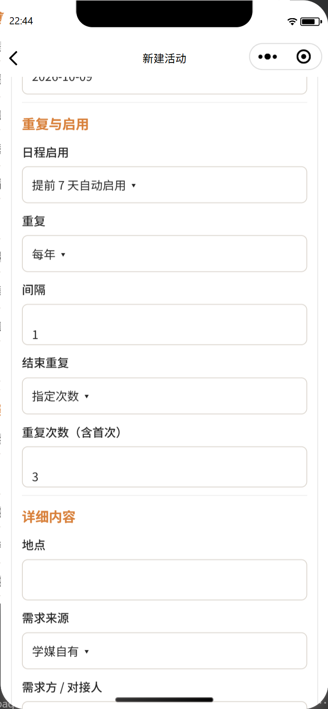

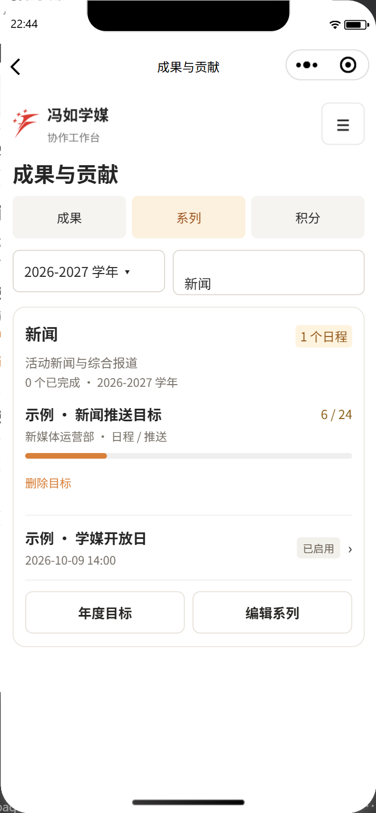

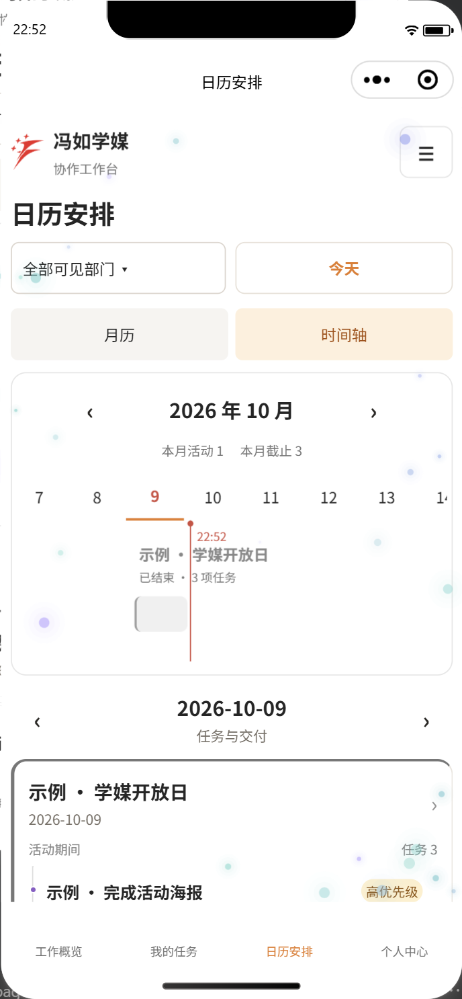

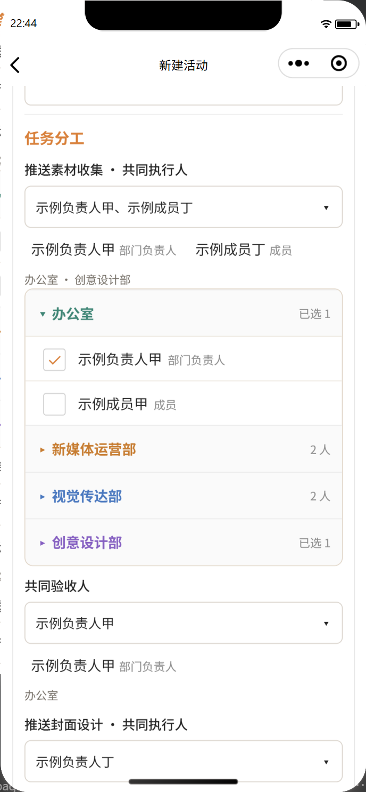

## 2. 修改资料与管理账号

网页：个人中心 → 我的资料。小程序／APP：个人中心 → 姓名与头像。

1. 填写姓名、选择头像，按页面提示提交审核。
2. 审核前公开资料保持原值。管理员在“成员与权限”的姓名与头像审核中批准或退回。
3. 批准后其他端刷新同步；退回后可重新申请。

改密码在“设置 → 账号与安全”或“我的”的改密入口操作。切换账号、退出登录也在个人中心；注销申请须填写原因并验证密码，等待管理员审核。提交待审申请后可以按页面提供的入口取消。

## 3. 设置语言与字号

进入“设置 → 通用”。

- 界面语言选择中文或 English，保存后同步当前账号。左上角“冯如学媒”品牌保持中文；成员姓名、任务内容和知识库正文保留原文。
- 系统字体大小可在 **85%—135%** 之间调整，默认 100%。拖动滑块先预览，保存后应用到各页；其他已登录设备刷新获取。
- 清除本机缓存后重新加载，服务器任务和账号登录保持；需要退出时使用退出账号入口。

字号变大后卡片、菜单和表单重新排布，阅读区域可以滚动。不要用浏览器缩放代替账号字号设置来判断跨端是否同步。

## 4. 设置主题与动效

进入“设置 → 外观”，选择强调色与白／黑／跟随系统显示。主题色影响按钮、标签等强调元素，白和黑控制基础背景。

“开启动效”控制粒子和组织图漂浮等动画。关闭后停止动态渲染；只想关闭粒子时将“粒子样式”设为关闭，其他界面动画可以保留。旧的紧凑布局与跟随系统减少动态效果选项已移除。

## 5. 配置高级粒子

在“外观”选定粒子样式。固定样式持续使用当前造型；随机样式在初始化时随机选择；定时轮换按设定间隔切换，间隔只在轮换模式下显示。粒子数量范围为 10—80。

网页设置页的局部画布可预览运动与颜色，小程序／APP 在当前设置页即时预览。调整后点击“保存设置”；未保存的调整不会成为账号的正式设置。关闭动效时预览也停止。

### 预设与渐变

- **极光流萤**：青绿到淡紫，柔和移动与闪烁。
- **樱花微风**：粉色到浅桃，轻微横向漂移。
- **银河星尘**：蓝色到淡紫，较慢运动，触点吸引。
- **森林萤火**：嫩绿到浅金，随机游动和较明显闪烁。
- **海盐蓝绿**：蓝色到青绿，横向流动，触点吸引。
- **日落流金**：珊瑚橙到金色，向上漂浮。

选预设会更新颜色与部分运动参数，仍可继续调整。颜色模式支持渐变、动态变色、单色、跟随主题。渐变使用起始与结束颜色，动态变色随时间循环变化；输入自定义颜色时使用 `#RRGGBB` 六位十六进制格式。

### 运动与生命周期

- **速度 0—180**：基础移动快慢；设为 0 时，引力、随机力和触点力仍可能使粒子移动。
- **水平／垂直引力 -160—160**：水平正值向右，垂直正值向下；负值方向相反。
- **阻尼 0—3**：越高越快减缓已有运动。
- **粒子碰撞**：开启后粒子之间及画布边界发生碰撞；关闭时可穿过边界循环出现。不是让粒子碰撞页面卡片或三维物体。
- **碰撞弹性 0—1**：控制碰撞后保留的运动，较高数值更有弹性。
- **生命周期 4—60 秒**：基础寿命，结束后重新生成；淡入淡出随寿命发生。
- **生命周期随机性 0—1**：使个体寿命围绕基础值变化。
- **粒子大小 1—8** 与 **大小随机性 0—1**：控制基础大小和个体差异。
- **运动随机性 0—1**：控制轨迹扰动，不会改变业务数据。
- **边缘分布比例／边缘聚集 0—1**：提高后更多粒子沿边缘出现，中心更淡；可覆盖网页导航区域而不拦截点击。

### 鼠标与触控

触点行为选择排斥、吸引或关闭。排斥使附近粒子远离鼠标／触控点，吸引使粒子靠近；关闭只停用触点作用，保留自然运动。

触点力度范围 0—600，作用范围 40—320。鼠标移出、触点松开或取消后结束相应作用。手机触摸仍能正常滚动和点击，粒子画布不会接管业务按钮。

### 光影与颜色

- **透明度 0.05—1**：越低越淡；想完全隐藏请关闭粒子。
- **亮度 0.2—2**：控制颜色明暗；过亮颜色可能达到显示上限。
- **闪烁幅度 0—1**：0 为无额外闪烁，数值越高明暗起伏越明显。
- **闪烁速度 0—4**：控制闪烁变化速度。
- **色彩变化速度 0—2**：作用于渐变和循环变色；单色和主题色不因这一项改变色相。

这套二维模拟参考 [Wallpaper Engine Operators](https://docs.wallpaperengine.io/en/scene/particles/component/operator.html) 的运动、阻尼与碰撞设置，以及 [Control Points](https://docs.wallpaperengine.io/en/scene/particles/component/control_point.html) 的交互思路。它不是完整 Wallpaper Engine 编辑器，不导入其工程或三维模型。

粒子卡顿或过于显眼时，先降低数量、透明度和闪烁幅度，或关闭碰撞／粒子。切到后台会暂停网页粒子运算，返回后恢复。

## 6. 新建活动与任务

网页：工作台或所有任务 → 新建活动。小程序／APP：工作台 → 新建活动。

1. 选择空白日程或流程模板，填写名称、日期和时间。
2. 在需求方／对接人中先选部门，再选成员；外部人员按页面提供的其他姓名入口填写。
3. 为分任务指定部门、负责人、验收人、截止时间、优先级和交付要求。
4. 可设置活动素材库链接、积分和奖励说明，确认后创建。

“我的任务”和“所有任务”按大任务组织分任务。未完成的靠前，最早截止的优先；截止时间相同再按优先级排序。仅标为高优先级的项目进入“急急急”。

## 7. 接单、提交与验收

打开任务详情检查负责人、验收人、截止时间与要求。接受任务后完成工作；时间冲突及时反馈，解决后恢复接单。存在前序依赖时，等待前序任务通过验收后解锁。

提交前完成检查清单。活动配置云盘时先打开素材库上传，再返回确认；成果链接应能被验收人访问。验收人通过后任务完成并记积分；要求修改时补充后重新提交。

任务要求、活动说明、成果正文和知识库可复制。网页选中正文复制；小程序／APP 支持正文长按选择，链接使用页面的复制按钮。日期、导航、状态标签禁止文字拖拽，避免误触浏览器搜索，正文复制不受影响。

## 8. 查看日历与调整排期

切换工作空间或部门筛选后，月历与安排列表只显示相应范围。点击日期查看当日大任务及分任务，点击具体任务进入详情。

小程序／APP 的月份格子提供任务提示，下方显示所选日期的层级安排；没有安排时显示空状态。通过月份切换、点选日期和纵向滚动浏览，无需在手机上拖动日期文字。

网页时间轴可横向浏览与缩放；有权限的负责人通过可拖动的任务／活动控件调整排期并确认，日期标签不能作为文字拖拽。未完成任务随活动平移，已经完成的记录保留。

## 9. 部门工作空间与组织架构图

点击工作空间切换入口，选择全体协作或对应部门。部门模式聚焦内部日程和人员，并采用部门强调色；账号权限不会随切换扩大。

在“组织与成员”查看组织架构图。点选部门展开成员气泡，点选成员查看其账号、姓名和头像；桌面也可悬停预览。支持的部门拖动交互会平滑调整位置，漂浮动画只表达组织关系。点击图中空白关闭浮出的资料。

管理员按权限管理账号、部门和资料审核；部门负责人管理本部门允许范围内的成员，普通成员没有这些管理权限。

## 10. 模板、成果与贡献

负责人在流程模板中编辑环节、相对日期、截止时间、前序依赖和交付要求；活动详情也可以保存为模板。新活动复用模板，后续修改模板不影响已经创建的活动。

“成果与贡献”汇总归档成果与积分。积分在任务验收通过后记账一次，其他奖励由负责人兑现。贡献排名不改变账号权限。

## 11. 同步、分享与连接

账号设置按账号同步。保存后当前端应用，同一账号的其他已打开设备刷新获取；不同账号互不覆盖。网页与小程序共用业务后端，不需要重复录入活动。

小程序可通过好友转发与朋友圈分享入口分享。分享只提供应用入口，不包含私有任务、成员资料、会话或邀请码；接收者仍需要正常登录。不要把含成员资料的截图作为公开分享内容。

手机连接失败时，在“个人中心 → 连接设置”核对服务地址。服务端需要保持运行，公网访问还需要固定隧道正常连接。清除缓存不会清掉服务器任务；不要通过重复初始化解决连接问题。

鼠标／触控位置只在本机内存中用于粒子计算，不上传、不持久化、不写日志。服务器只保存经验证的外观参数；数据库、备份与部署凭据不进入公开仓库。

更新源码不会自动更新已经安装的 APP 或已发布小程序。APP 需要重新构建安装，小程序需要另行上传发布，本轮不上传微信小程序。知识库正文是构建时打包的快照，维护者更新文档后重新构建网页服务即可同步到在线知识库。

## 12. 微信小程序逐步使用

### 12.1 首次进入与登录

1. 在微信打开小程序，进入登录页，输入管理员提供的用户名与密码。用户名是登录账号，姓名是公开显示的名字，两者不一定相同。
2. 可选勾选“记住账号密码”。默认不勾选，适合借用设备；勾选后记住账号并保持登录，登录状态最长 30 天，仍受会话失效、账号锁定和权限限制。
3. 小程序仅在设备支持微信加密存储接口时保存加密的密码。不支持时只记住账号并保持登录，并显示相应提示；系统不会把密码写入普通本地存储。网页端交由浏览器密码管理器保存密码。
4. 点“登录”。记住的账号或密码只会填入表单，不会自动提交登录请求，也不能跳过验证码。验证码出现时输入图片中的 5 位字符；点击图片可换一张，冷却倒计时结束后再登录。不要连续重复点登录。
5. 第 10 次密码错误会锁定，等待或填写正确密码也不能自行解锁；联系管理员取得一次性重置链接，设置新密码后再登录。

取消勾选“记住账号密码”会清除本机保存的账号与加密密码。退出会话保留此前主动记住的资料；借用设备应先取消勾选，再退出账号。切换账号时不会自动填回旧账号；改密或使用重置链接后清除记住的旧密码。账号切换后不会沿用上一账号的任务快照。审核封存期间不预填历史用户名或密码。

网页清除的是本网站记住的账号选项；浏览器自身密码管理器的保存条目需要在浏览器设置里删除，网站无法替你清除浏览器密码库。

审核封存期间，上述选项改为“保持登录”，只选择是否保持 30 天登录，不读取或保存用户名密码；登录页提示仅初始管理员可登录，不显示注册入口。审核通过并由维护者恢复后重新提供普通模式的“记住账号密码”。

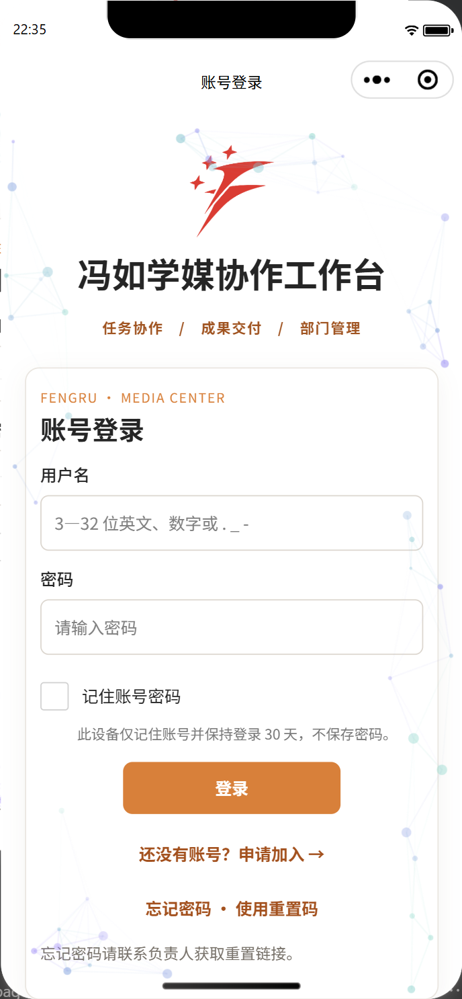

### 12.2 审核封存期间可以看到什么

提交审核前暂时只保留初始管理员可用，其余账号不可登录、不可查看，也不出现在组织成员、执行人、排名或日志等入口。审核时初始管理员显示为“审核管理员 / review_admin”，不展示原始姓名、账号或头像；实际登录凭据不变。原始账号状态和协作资料保留在受保护的完整本机备份中，审核时使用独立的干净工作空间，之后由维护者恢复。

封存涵盖所有历史用户内容：活动日程、任务、流程模板、成果、积分、通知、资料申请、个人设置和历史统计均不进入审核视图。审核期间访问统计保持为空，微信账号绑定暂时关闭。审核期空列表是有意隔离的结果；本机修复和刷新不会释放历史资料。

初始管理员仍没有部门、不能成为任务执行人。审核期间没有可派单成员，人员选单为空是正常现象；请不要为补齐演示任务而给管理员自派，也不要重新初始化或重复注册旧账号。下面的截图用匿名样例说明恢复后正常协作时的页面。

审核通过后，只有在用户明确要求恢复时由维护者处理；先用启动脚本核验并停止本工作区源服务，执行封存恢复命令，再重新启动。8766 端口仍运行时切换会被拒绝。完整 PowerShell 步骤见《知识库 → 小程序审核前的账号封存》。

### 12.3 工作台与四个底部入口

登录后进入“工作台”。底部四个入口为“工作台、任务、日历、我的”；点入口即可切换，长页面向上滑动继续查看。顶端的工作空间按钮用于切换全体协作或部门视角，只改变浏览范围和主题，不增加权限。

工作台先显示有标记的“急急急”、状态数量、近期活动和待办；普通任务不会因为快截止就自动进入“急急急”。管理员和有权限的负责人可以看到“新建活动”。任务先按未完成、最早截止排序，截止相同再按优先级排序。

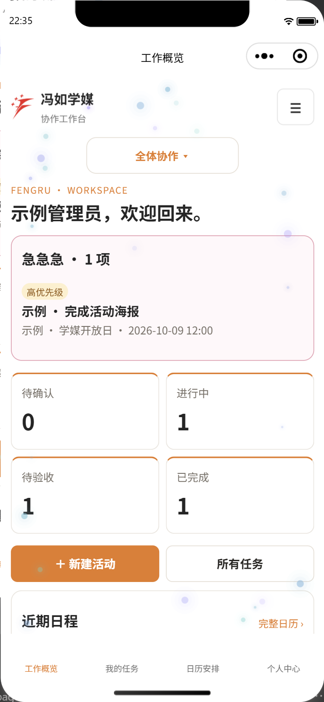

### 12.4 从任务列表进入详情

1. 点底部“任务”，选择“我负责”“我验收”或“全部可见”。初始管理员不会在“我负责”中获得执行任务，可在“我验收”或“全部可见”查看授权内容。
2. 点活动标题展开或收起分任务；点具体分任务进入详情。先核对共同执行人、共同验收人、截止、优先级、积分总额和交付要求。
3. 普通执行人先确认接单。时间冲突要及时反馈；有前序任务时，等前序完成再继续。
4. 管理员可代所有成员交付或归档；部门负责人仅可代本部门普通成员的任务，跨部门或包含另一负责人的执行名单不能越权代操作。按钮只在当前账号具备权限、任务状态允许时出现。

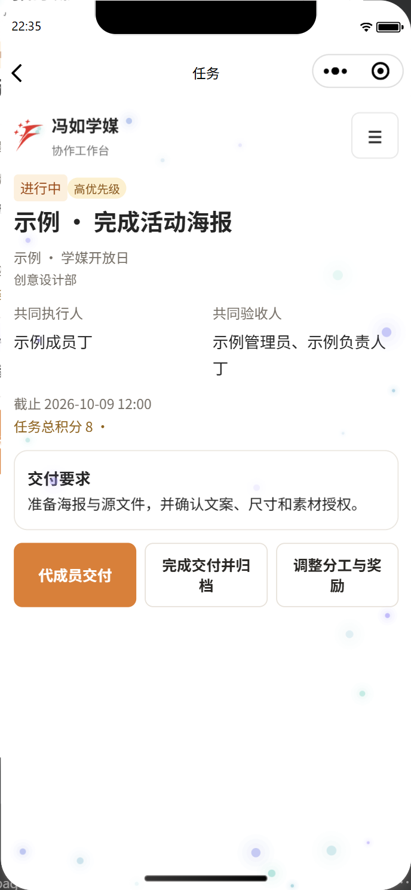

### 12.5 填写成果、验收与归档

点“提交成果”或有权限的“代成员交付”，逐项勾选检查清单，填写成果与交接说明。活动配置了素材库时，先点复制素材库链接，在云盘客户端或浏览器完成上传，再返回确认已上传；填写个人成果链接后，确认验收人能够访问。小程序不能直接打开任意外部网页，因此链接提供复制入口。

执行人提交后任务进入待验收，由名单中的验收人按权限通过或要求修改。管理员或符合范围的负责人可以点“完成交付并归档”，仍需填写说明、完成全部核对项和上传确认。重复提交不会重复计分，最终共同执行人分摊任务总积分。

在“个人中心 → 所有任务 → 归档”查看已完成任务。已归档任务不再参与未完成列表排序，仍可从日历打开历史详情，显示灰色。已完成任务不能重新修改分工。

### 12.6 日历中寻找当天任务

1. 点底部“日历安排”，用上方部门选单过滤当前有权查看的部门。
2. 用月份左右箭头切换月份，或点“今天”返回当前日期。格子中的数量、圆点和简短标题说明这天有安排；高优先级使用强调提示。
3. 点日期后，下方显示该日活动与分任务。每张活动卡先显示大任务名称，再显示具体交付任务、执行人、状态和截止时间，完成项变灰。
4. 如果活动期间还有其他日期截止的分任务，点“展开其他分任务”。点任务行进入详情；点活动标题进入活动页。没有安排时查看空状态或“最近有安排”，不要凭灰色或空格判断任务已经被删除。
5. 在下方安排区向上滑动可看到被月历挡在下方的列表；日期数字不可长按复制，任务要求和成果正文仍可长按选择。

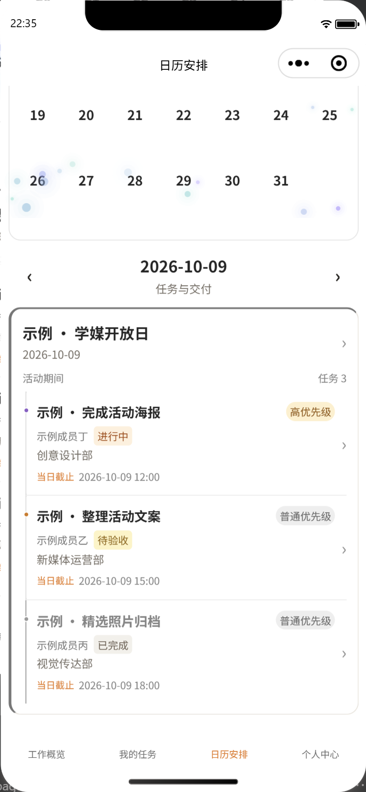

### 12.7 个人中心

点底部“个人中心”，顶部圆形头像或姓名卡进入姓名与头像设置。部门和职位分开显示；初始管理员显示无部门。这里还提供积分、系统设置、本机安全中心、账号切换、退出、知识库、组织与成员、所有任务和连接设置。访问统计仅管理员可见。

修改头像时，选择图片，在圆形预览内拖动取景，用双指或缩放滑块调整大小；“重置位置”恢复初始取景。“使用头像”只是写入当前资料草稿，再点资料页提交才进入审核；取消不会上传。裁剪结果去掉原文件元信息，压缩后以圆形显示。姓名和头像批准后才同步给其他人。

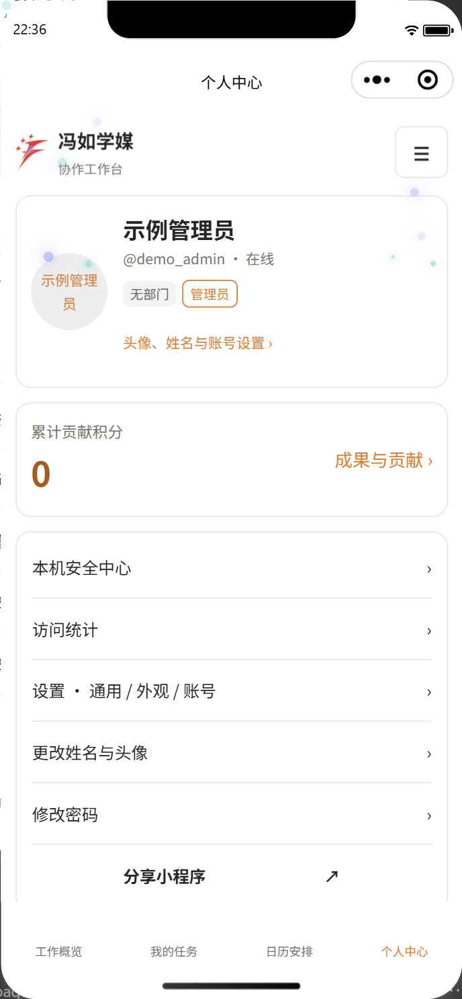

### 12.8 外观、语言与字体

“个人中心 → 系统设置”中，通用提供中文／English 和 85%—135% 字号；外观提供主题色、白／黑／跟随系统、动效与粒子设置。设置时可先预览，点“保存设置”才成为账号正式设置。其他已登录设备刷新获取，任务名称、成员姓名和品牌“冯如学媒”保持原文。

先选粒子样式和色彩预设，再选择运动与生命周期、触控交互或光影与颜色调整参数。“定时轮换”选中后才显示轮换间隔；不想显示粒子可选关闭，关闭“开启动效”还会停止组织图漂浮。照片裁剪、业务链接和任务内容不会随着主题设置上传到诊断中。

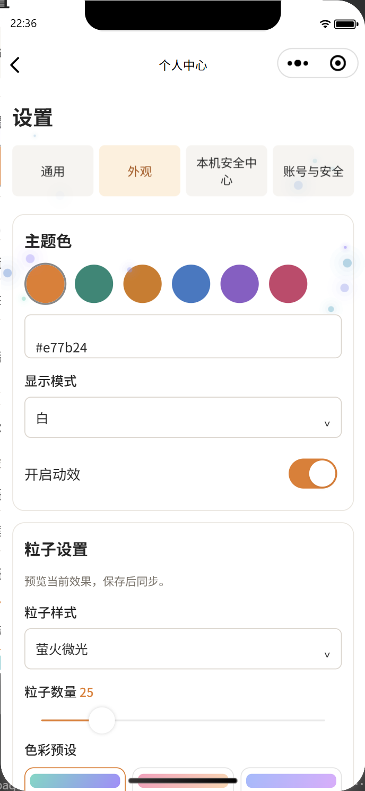

### 12.9 查看成员在线与操作组织图

“个人中心 → 组织与成员”中，点部门圆泡展开成员；点成员查看姓名、账号、头像与职位，点空白关闭资料。圆泡的拖动、松手惯性、碰撞、空白平移以及双指缩放均在本机进行；右上方缩放按钮和“居中”也可调整视图，展开和查看资料时仍会漂浮。

成员泡、名单和资料卡中的绿色“在线”表示有至少一个前台设备仍在发送心跳，灰色“离线”表示没有有效前台心跳。前台约每 25 秒更新，90 秒没有更新即过期；退到后台会主动报离线，如果对方还有另一台前台设备则仍在线。网络中断或系统延迟时状态可能滞后，不把“离线”当作拒绝工作或阅读消息的证明，也不显示最后上线时间。

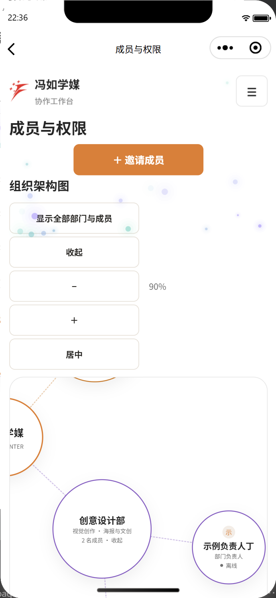

### 12.10 本机安全中心与常见问题

“个人中心 → 本机安全中心”或“系统设置 → 本机安全中心 → 打开本机安全中心”都可进入。这里无需网络，只显示当前设备的存储、展示配置、页面渲染、背景画布能力、缓存大小、版本及匿名固定错误码。

| 现象 | 建议操作 |
| --- | --- |
| 页面或粒子异常，进入安全外观 | 一键本机修复；仍异常时重置本机外观，回工作页面刷新 |
| 字号、颜色或显示缓存异常 | 清除展示缓存；这不会删除服务器任务、账号或登录凭据 |
| 界面卡住 | 重启界面；重新打开后按当前登录状态进入工作台或登录页 |
| 任务变为只读 | 网络恢复后下拉刷新；写操作不会自动重试，不要反复提交同一成果 |
| 无法连接 | “个人中心 → 连接设置”核对服务地址 `https://fengrumedia.dpdns.org`；不要反复初始化数据库 |
| 密码锁定或审核封存账号不可用 | 联系管理员或维护者；本机修复不能解除服务端权限限制 |

需要反馈问题时可复制脱敏诊断，只包含版本、能力、缓存大小和固定错误码，不包含姓名、账号、任务、密码、令牌或服务地址。本机安全中心不包含服务器健康状态，也不会上传本机错误原文。

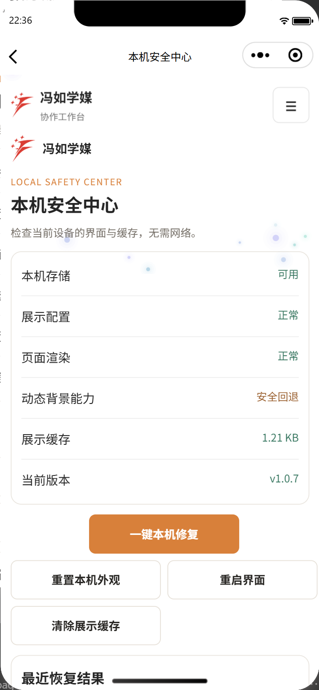

### 12.11 分享与查阅图解

从“个人中心 → 分享小程序”或微信右上角菜单转发好友／分享到朋友圈，只分享小程序入口。接收者仍需正常登录；私有任务、会话、邀请码不会放进分享链接。公开分享时避免截取真实成员资料。

“个人中心 → 知识库 → 工作台操作手册 · 图解”阅读正文和最新版配图，点配图可放大。源码目录的 `web/sop/screenshots/` 与本文相对链接可以离线查阅；在线知识库需要先登录。维护者更新正文或截图后必须重新构建服务，不通过清除缓存代替发布。

## 常用操作

1. 组织图：点击展开后继续漂浮；可拖母/子圆泡，松手有惯性，气泡碰撞避免重叠。滚轮、＋/−或双指缩放，空白平移，居中恢复视图。点成员固定的是资料卡，气泡仍运动。
2. 创建活动和任务：执行人、验收人可多选，姓名旁职位帮助区分；初始管理员仅可监督验收。调整分工可以改名称、时间、要求、核对项、前序、优先级和奖励。负责人转派本人工作时选择本部门下属，积分随最终执行人转移。
3. 任务详情：有权限的管理员或部门负责人可代交付或代交付归档，仍需完成所有交付检查。所有任务 → 归档查看完成历史，日历灰色保留。
4. 头像：选择图片 → 拖动/缩放圆形预览 → 使用头像 → 提交审核，取消不提交。
5. 设置 → 安全中心检查本机状态、修复显示缓存、重置本机外观、复制脱敏诊断。断网快照只读，恢复后刷新再编辑。
6. 管理员在站长统计查看趋势、国家地图、脱敏网段、风险与日志，按建议处理；维护/清除统计不删除任务。
7. 密码第 3 次错误开始冷却并要求验证码，第 10 次锁定后联系管理员走一次性重置链接。完整计时、权限表、隐私与回退流程见知识库 v1.0.5 章节。
